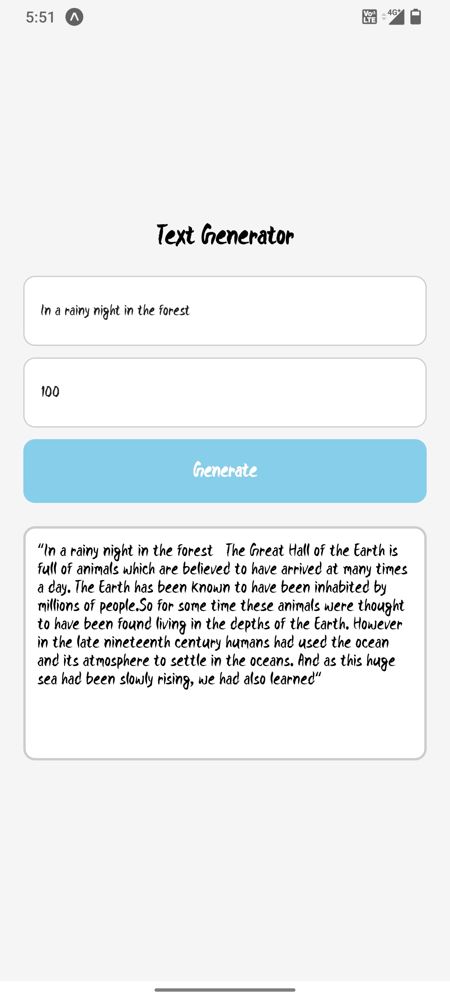

React Native Text Generation App

This is a console-based React Native app that generates text using a backend API. The app allows users to enter a text prompt and the desired number of words, and then it fetches the generated text from the API.

The generated text is displayed in the console with a typing effect, and users can also download the generated text as a .txt file.

Installation:
1. Clone the repository:
   $ git clone https://github.com/hariharancse11/AI_ReactNativeApps

2. Install the dependencies:
   $ cd AI_ReactNativeApps
   $ npm install

Usage:
1. Open a console or terminal.

2. Navigate to the project directory.

3. Enter a text prompt and the desired number of words in the console.

4. Run the app:
   $ npm start

5. The generated text will be displayed in the console with a typing effect.

6. To download the generated text as a .txt file, press [Ctrl + C] to stop the app, and then use your preferred method to save the text in a .txt file.

Dependencies:
- react: [insert version]
- react-native: [insert version]
- react-native-typewriter: [insert version]
- react-native-fs: [insert version]

Contributing:
Contributions are welcome! If you encounter any issues or have suggestions for improvements, please create an issue or submit a pull request.

React Native Text Generation App

  ______        __                                  __   __    __                 
 /      \      |  \                                |  \ |  \  |  \                
|  $$$$$$\  ____| $$ _______   ______   __    __  _| $$_| $$  | $$____    ______  
| $$___\$$ /      $$|       \ /      \ |  \  |  \|   $$ \ $$  | $$    \  /      \ 
 \$$    \ |  $$$$$$$| $$$$$$$|  $$$$$$\| $$  | $$ \$$$$$$ \$$  | $$$$$$$\|  $$$$$$\
 _\$$$$$$\| $$  | $$| $$      | $$  | $$| $$  | $$  | $$ __      | $$  | $$| $$   \$$
|  \__| $$| $$__/ $$| $$_____ | $$__/ $$| $$__/ $$  | $$|  \     | $$__/ $$| $$      
 \$$    $$ \$$    $$| $$     \ \$$    $$| $$    $$   \$$  $$ __ | $$    $$| $$      
  \$$$$$$   \$$$$$$$ \$$$$$$$$  \$$$$$$  \$$$$$$     \$$$$$$$|  \ \$$$$$$$ \$$      
                                                               \$$                    
This is a console-based React Native app that generates text using a backend API. The app allows users to enter a text prompt and the desired number of words, and then it fetches the generated text from the API.

